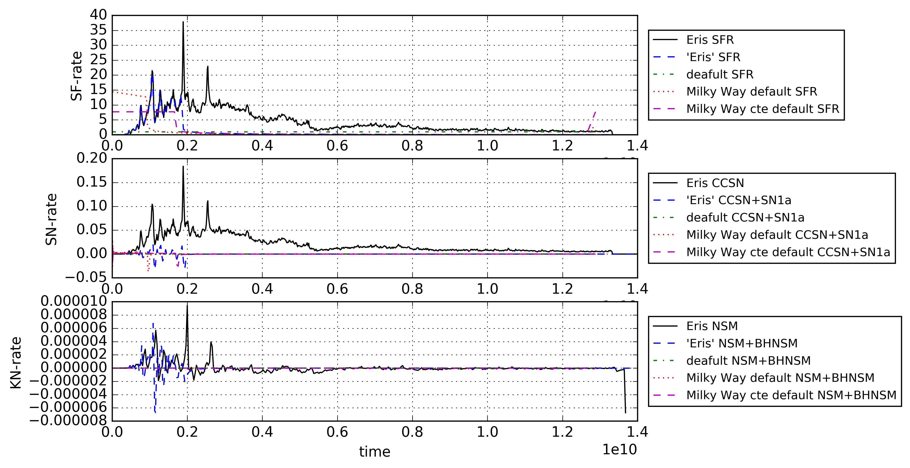
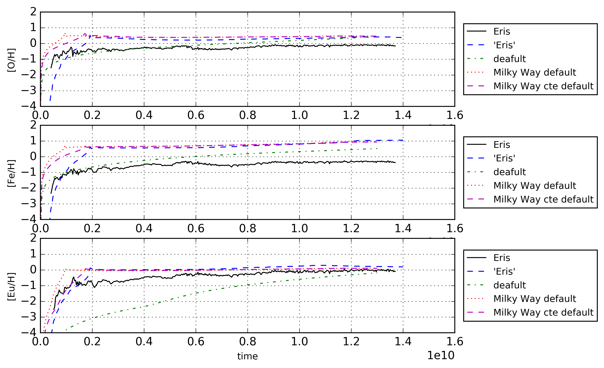
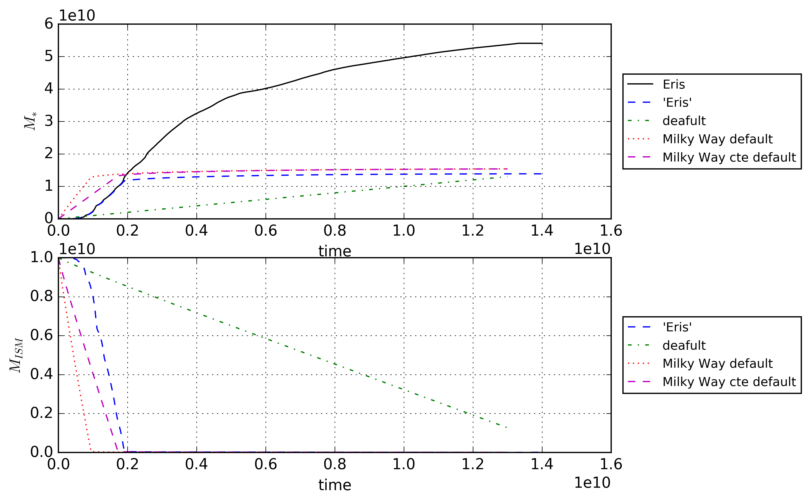

Best fit of 'Omega' parameters - v0
===========================================

Set appropriate parameters directly from 'Eris'.

Parameters
-----------

- Star formation rate as a function of time
- Use initial mass function from 'Kroupa et. al. (1993)'
- Let simulation run for 14 Gyr
- Turn on type 1a supernovae
- Turn on binary neutron star mergers (hence BNSM or NSM)
- Use a BNSM-yield table that actually contains Re-187 isotopes
- Turn off mergers between neutron stars and black holes

Default options for Milky Way
--------------------------------
When simulating the Milky Way Galaxy with 'Omega' the user is left with three option.

- Supply no parameters, and let 'Omega' calculate the chemical evolution with default parameters.
- Use the built-in option of the Milky Way lookalike which uses an current dark matter mass of 1e12 solar masses, and currentstellar matter mass of 5e10 solar masses. There are two options for star formation history/rates.
  - The star formation rate is constant (1.0 solar masses per year) 
  - The star formation rate follows the Chiappini et. al. (2001) star formation history.

** You should probably mention that you can always specify all parameters manually as well, and that your approach has been to take one of the options above and tweak it until it matches ERIS as close as possible.

Results
--------

A big problem so far is that the star formation rate uses up all gas, thereby killing all star-formation and essentially all chemical evolution. ** move this sentence to the intro/section on parameters**
Below are the resulting plots for the three default options, marked; 'default', 'Milky Way default', and 'Milky Way cte default' respectively. The datapoints marked Eris in black represent the data from the large, SPH, zoom-in simulation. The datapoints marked 'Eris' **in blue** are from 'Omega' with the parameters specified above. ** distinguish between lines and data points **

- As can be seen: all star formation drops to zero after ~2Gyr, but up until that point the star formation rate of 'Eris-lookalike' perfectly matches the actual 'Eris' SFR. Scale-wise, the NSM-rates are of the desired magnitude, SN-rates are not. **format the y-axis in Gyr (see https://stackoverflow.com/questions/11577665/change-x-axes-scale-in-matplotlib) **

- Not much to comment, the gas-contents becomes depleted.

- it is clear that the ISM becomes empty, but until that point the cumulative stellar mass of the 'Eris-lookalike' perfectly matches the 'Eris' data. ** Does ERIS represent a bigger galaxy with more gas since the star formation isn't suppressed? **

Comments to self
------------------

datafiles to be used in thesis:
 - [M\_gas](data/highres_eris_parameters_gas_mass_explanatory.txt)
 - [M\_star](data/highres_eris_parameters_m_locked_explanatory.txt)
 - [sfr](data/highres_eris_parameters_rates0_explanatory.txt)
 
[Go back](../README.md)
