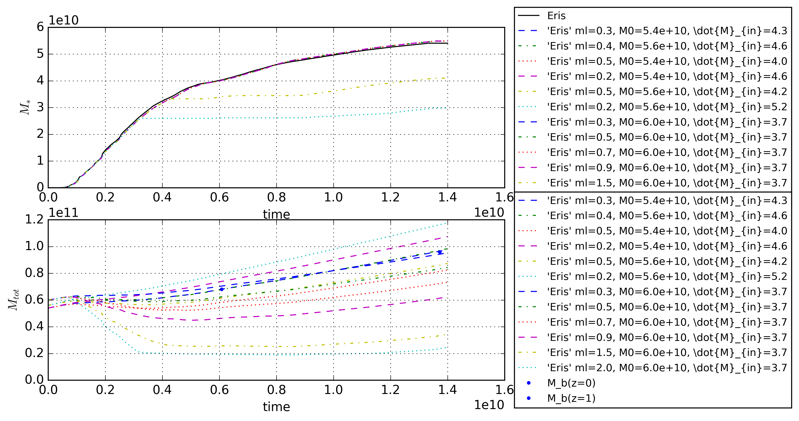

Best fit of 'Omega' parameters - v1
===========================================

Set mass parameters of 'Omega' by comparing to 'Eris'.

Parameters
-----------
- Initial total mass of gas
- Constant inflow rate
- Outflow rate proportional to super nova rate

Methodology
------------
Increase initial gas mass and constant inflow rate to fit total stellar mass over time, and total baryonic mass at redshift zero and one(datapoints added NEED REFERNCE AND EXPLANATION). ** Redshift zero and one? Also add a paranthesis (z=0, t=14.7 Gyr or whatever it corresponds to). ** The initial gas is primordial in nature, as is the inflow, but the outflow consists of chemically evolved gas.
After those criteria are met, add outflow (proportional to snr), and increase initial gas mass and inflow slightly to compensate. The outflow rate will make the results worse ** what do you mean by results worse? make the Omega and Eris models deviate more? Try to be presice with the language"**, but add to the realism of the model.

Results/progress
------------------

First apply inflow and initial gas mass only. The best fit is an initial gas mass ~4.4e+10 M\_sol and a **constant** inflow rate of ~3.7 M\_sol/yr.

**Maybe it's worth do do some of these plots relative to ERIS rather than just comparing?**

Now increase inflow and initial gas mass slightly, and try different values for mass-loading(solar masses ejected from galaxy per solar masses exploded). 
The inflow rate is increased to 4.0 M\_sol/yr and the initial mass of gas increased to 5.6e+10 M\_sol.
The mass-loading factor has to be as low as 0.3 in order to not eject to much chemically evolved gas.

Outflow cannot reproduce the "valleys of death" in the spectroscopic data, only slight variation around dips.

If the initial gas mass is fixed to the final, total mass from the 'Eris' data, the new 'Eris-lookalike' can be compared to the 'default', 'Milky Way default', and "Milky Way cte default' already existing in 'Omega'. Increasing the initial gas mass removes the issue on "running out of gas". The results are plotted below.

**Where do the Mb data points come from? Observations/simulations?**

Comments to self
------------------
Datafiles to be used in thesis
 - [Initial mass and inflow (stellar mass)](data/mass_parameters_v1_1_n1100_explanatory.txt)
 - [Initial mass and inflow (total mass)](data/mass_parameters_v1_2_n1100_explanatory.txt)
 - [Add mass-loading (stellar mass)](data/mass_parameters_v2_1_n300_explanatory.txt)
 - [Add mass-loading (total mass)](data/mass_parameters_v2_2_n300_explanatory.txt)
 - [Model comparison (stellar mass)](data/mass_parameters_v3_masses_1_n300_explanatory.txt)
 - [Model comparison (total mass)](data/mass_parameters_v3_masses_2_n300_explanatory.txt)
 - [Model comparison (sfr)](data/mass_parameters_v3_rates_0_n300_explanatory.txt)
 - [Model comparison ([O/H])](data/mass_parameters_v3_spectro_0_n300_explanatory.txt)
 - [Model comparison ([Fe/H])](data/mass_parameters_v3_spectro_1_n300_explanatory.txt)
 
[Go back](../README.md)

TOSS OLD SCRAP BENEATH THIS POINT

Version One - Single parameters
-----------------------------------

This folder is varying a single parameter at a time.

mgal - The initial mass of the galaxy [M\_sol]
inflow\_rate - The constant inflow of mass [M\_sol/yr]
outflow\_rate - The constant outflow of mass [M\_sol/yr]
sfh\_array\_norm - The total amount of stellar mass formed [M\_sol]
imf\_bdys - Mass boundaries of IMF [M\_sol]
f\_arfo - Fraction applied to yields of massive stars []
TODO!!! nsm\_table
nsmerger\_bdys - Mass boundaries of NSM-events [M\_sol]
nb\_nsm\_per\_m - Number of NSM per stellar mass formed []
f\_binary - Fraction of binary systems in the galaxy
f\_merger - Fraction of binary systems that merge
m\_ej\_nsm - Mass of ejecta from NSM
t\_nsm\_coal - Time after which all compact binary systems merge [yr]
t\_merger\_max - 
pop3\_table - which table of population III ejecta to use
imf\_bdys\_pop3 - Mass boundaries of population III IMF
imf\_yields\_range\_pop3 - Mass boundaries of population III ejecta

Methodology
------------
The different parameters are listed in [parameter-space](parameter_space.txt), alongside all the different parameters to be tested ended by the name of the image-file generated.
There is a single plotting-script for each parameter, and a script that call each one of them when an 'update' is in order.
The images are stored in the [image-folder](variable_plots), but the results are also summarized in [the results](Results.md).

Personal notes
----------------
Sfr-normalization should be set by the default Eris-parameters, since it uses the last value of the 'm_growth' array in the 'sfr'-dictionary.

Value = 38914300000.0
