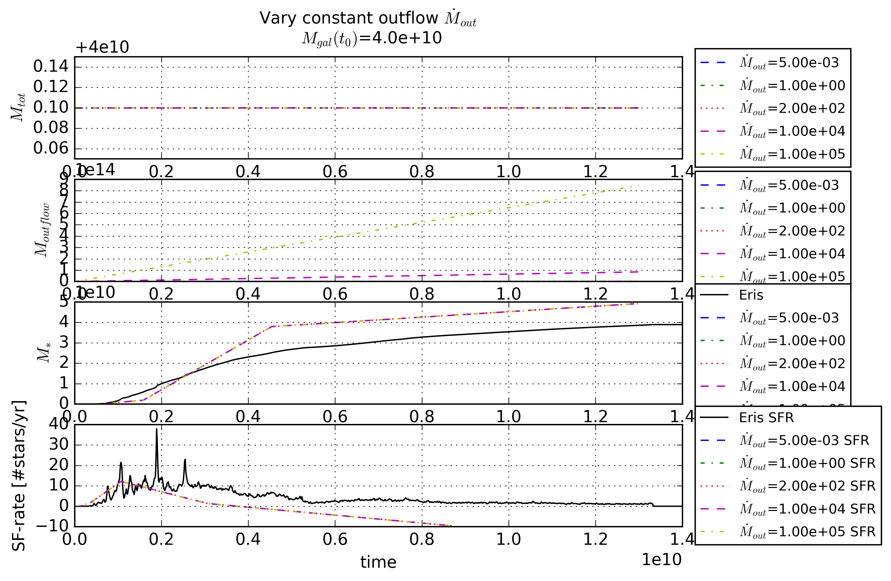

Results
========

Parameters that matter
------------------------
-Initial galactic mass
    -
-Inflow
    -
-Outflow
    -
-Normalization of SFR
    -
-Fraction of binary systems
    -
-Fraction of merging binary systems
    -
-Mass ejected from NSM
    -
    
