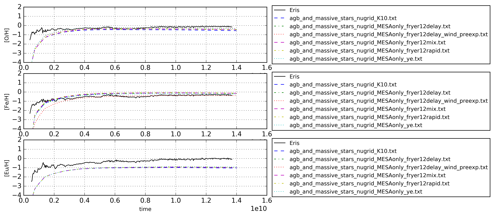
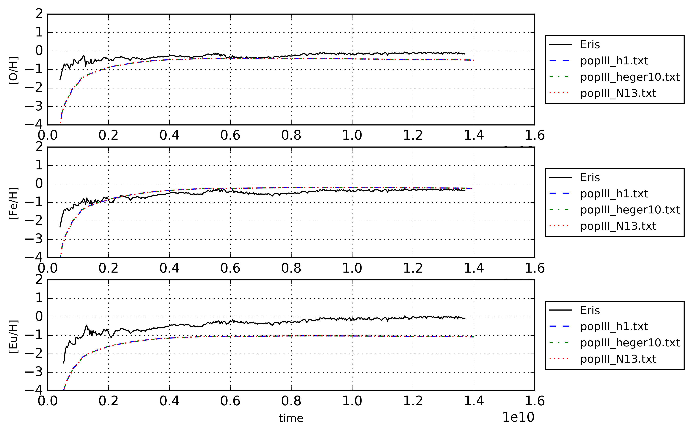
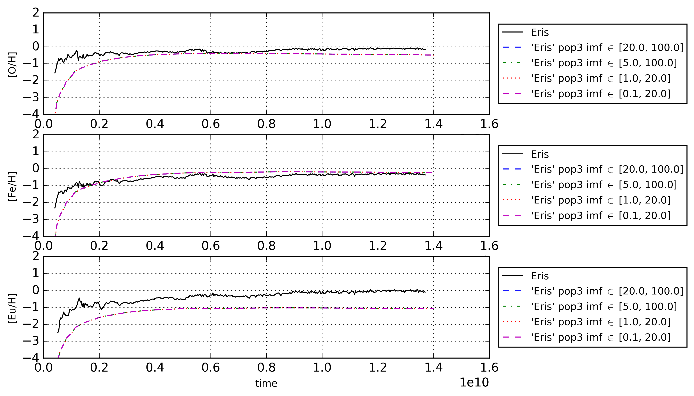
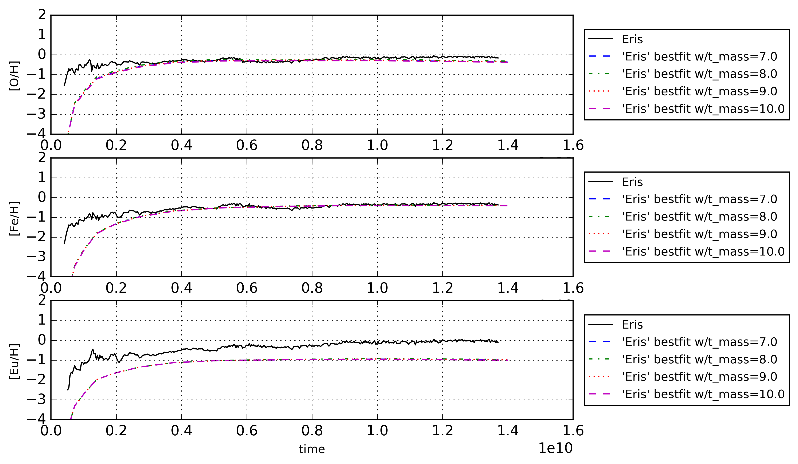
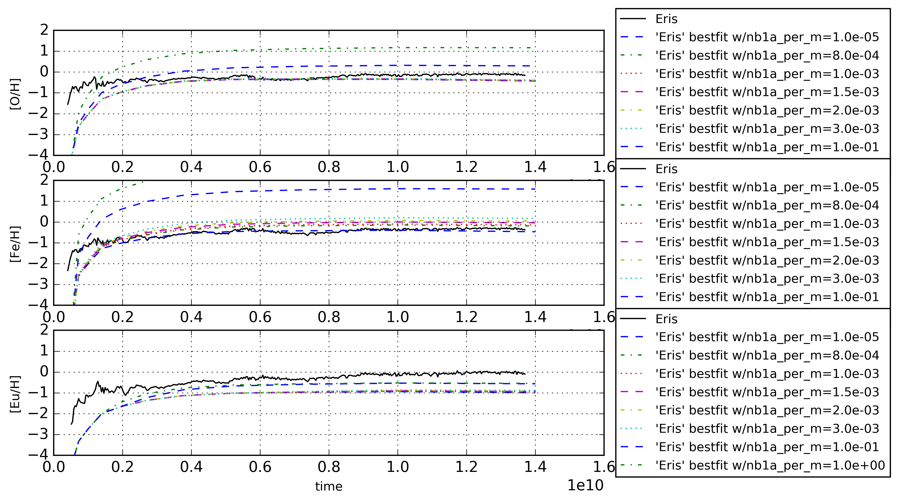
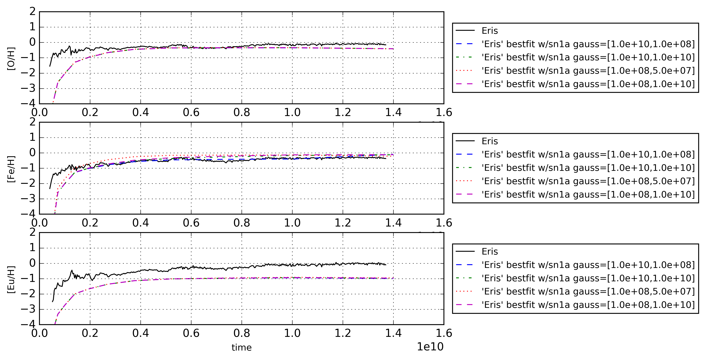
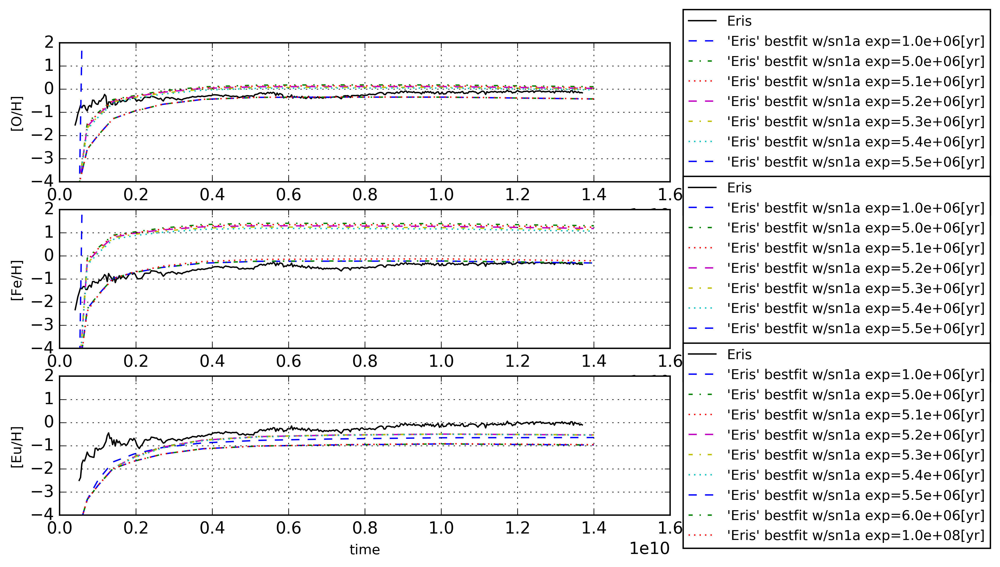
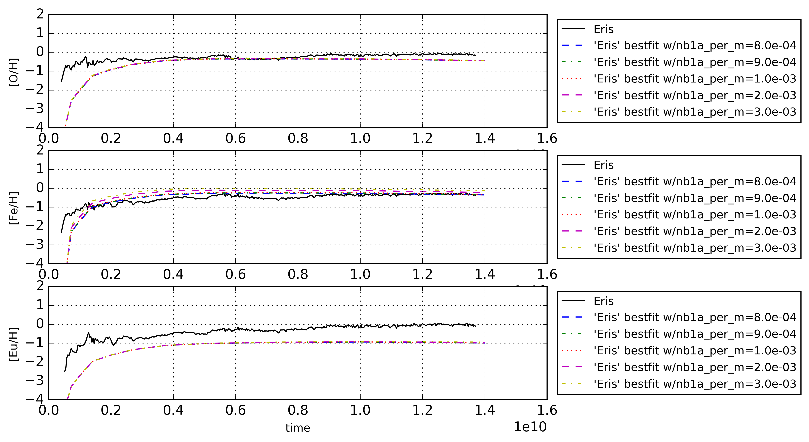

Best fit of 'Omega' parameters - v2
===========================================

Set stellar and type 1a supernova  parameters of 'Omega' by comparing to 'Eris',
more specifically the spectroscopic oxygen and iron abundances ([O/H] and [Fe/H]).

Parameters
-----------

- yield-tables for agb and massive stars
- transitionmass **? mass limits where you switch between different tables?**
- population 3 stars yield tables and IMF boundaries

- number of type 1a supernovae
- yield tables for type 1a supernovae
- delay-time distribution of type 1a supernovae (three types plus direct normalization).
** You should mention where all the yield tables come from (references)**

Results
--------
- Other agb and massive yield tables
  - Found minimal variation
  - `nugrid_MESAonly_fryer12delay_wind_preexp` seems the best fit, by having the least amount of iron and most oxygen.
  
- Population III stars
  - various tables have no effect on spectroscopic data **Can you explain in two lines why? I assume it's because you're considering heavy elements that are not produced in significant amounts by popIII stars. Btw. you should probably also comment on the discrepancy in Eu first time you show it (just stating that your only partway in the parameter tuning)**
  
  - boundaries of initial mass function **Does not appear to have any significant effect either**
  
- Transitionmass between AGB and massive stars have almost no effect on spectroscopic iron, 
higher transitionmass means lower iron but the effect is neglectable. Leave as is! ** Rather state that you leave it at the default value of XX**

- SN1a numbers ** rates?** scale all spectroscopic abundances up and down (unsurprisingly). Want a value somewhere between 1e-4 and 1e-3 supernovae per solar mass. This prioritizes iron over oxygen.
  - nb1a ~ 8e-4
 
- SN1a delay-time distribution: **Explain in few words what the delay time distribution is, and that power-law, gaussian and exponential are the standard choices (provide a reference, can possibly just be an OMEGA paper**
  - power-law: Minimal effect, flatter distribution gives slightly less iron between 1 and 6 Gyr.
  
  - gaussian: slighlty less iron for distribution with old mean.
  
  - exponential: weird effect with exponential decay-time lower then 5 Myr(see plots).
    - ~5.5e+6
   
- Direct normalization of \#SN1a has no effect
- yield tables of type 1a supernovae yield no noticable difference ** Is that because SN have little effect overall, or because the yield tables are very similar?**

- rescaling SN1a numbers
  - nb1a ~ 1e-3
   

Comments to self
------------------
Datafiles to be used in thesis
 - Files with no significant effect (thereby showing why they can be neglected).
   - [population III stars - yield tables - [O/H]](data/star_parameters_v3_0_n300_explanatory.txt)
   - [population III stars - yield tables - [Fe/H]](data/star_parameters_v3_1_n300_explanatory.txt)
   - [population III stars - mass function boundaries - [O/H]](data/star_parameters_v4_0_n300_explanatory.txt)
   - [population III stars - mass function boundaries - [Fe/H]](data/star_parameters_v4_1_n300_explanatory.txt)
   - [transitionmass between agb and massive - [Fe/H]](data/star_parameters_v2_1_n30_explanatory.txt)
   - [supernovae type 1a - yield tables - [Fe/H]](data/sn1a_parameters_v3_spectro_1_n30_explanatory.txt)
 - Files with some aspect of effect.
   - [\#SN1a - first try - [O/H]](data/sn1a_parameters_v1_spectro_0_n30_explanatory.txt)
   - [\#SN1a - first try - [Fe/H]](data/sn1a_parameters_v1_spectro_1_n30_explanatory.txt)
   - [dtd SN1a - power law - [O/H]](data/sn1a_parameters_v2_powerlaw_spectro_0_n30_explanatory.txt)
   - [dtd SN1a - power law - [Fe/H]](data/sn1a_parameters_v2_powerlaw_spectro_1_n30_explanatory.txt)
   - [dtd SN1a - gaussian - [O/H]](data/sn1a_parameters_v2_gauss_spectro_0_n30_explanatory.txt)
   - [dtd SN1a - gaussian - [Fe/H]](data/sn1a_parameters_v2_gauss_spectro_1_n30_explanatory.txt)
   - [dtd SN1a - exponential - [O/H]](data/sn1a_parameters_v2_exp_spectro_0_n30_explanatory.txt)
   - [dtd SN1a - exponential - [Fe/H]](data/sn1a_parameters_v2_exp_spectro_1_n30_explanatory.txt)
   - [\#SN1a - second try - [O/H]](data/sn1a_parameters_v4_spectro_0_n30_explanatory.txt)
   - [\#SN1a - second try - [Fe/H]](data/sn1a_parameters_v4_spectro_1_n30_explanatory.txt)

[Go back](../README.md)
