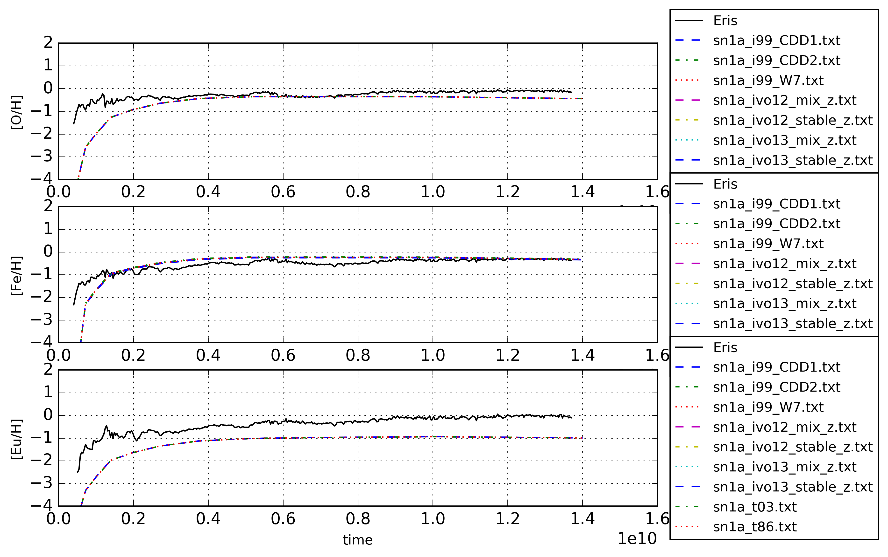

Best fit of 'Omega' parameters - v2
===========================================

Set stellar and type 1a supernova  parameters of 'Omega' by comparing to 'Eris',
more specifically the spectroscopic oxygen and iron abundances ([O/H] and [Fe/H]).

Parameters
-----------

- yield-tables for agb and massive stars
- transitionmass
- population 3 stars yield tables and IMF boundaries

- number of type 1a supernovae
- yield tables for type 1a supernovae
- delay-time distribution of type 1a supernovae (three types plus direct normalization).

Results
--------
- Other agb and massive yield tables are buggy
- Population III stars
  - various tables have no effect on spectroscopic data
  
  - boundaries of initial mass function 
  
- Transitionmass between AGB and massive stars have almost no effect on spectroscopic iron, 
higher transitionmass means lower iron but the effect is neglectable. Leave as is!

- SN1a numbers scale all spectroscopic abundances up and down (unsurprisingly). Want a value somewhere between 1e-4 and 1e-3 supernovae per solar mass. This prioritizes iron over oxygen.
  - nb1a ~ 8e-4
 
- SN1a delay-time distribution:
  - power-law: Minimal effect, flatter distribution gives slightly less iron between 1 and 6 Gyr.
  
  - gaussian: slighlty less iron for distribution with old mean.
  
  - exponential: weird effect with exponential decay-time lower then 5 Myr(see plots).
    - ~5.5e+6
   
- Direct normalization of \#SN1a has no effect
- yield tables of type 1a supernovae yield no noticable difference

- rescaling SN1a numbers
  - nb1a ~ 1e-3
   

