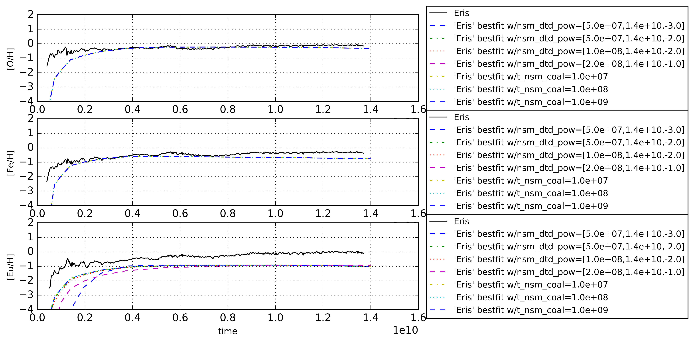

Best fit of 'Omega' parameters - v3
===========================================

Fix the neutron star merger parameters to fit [Eu/H] from 'Eris'

Parameters
-----------

- delay-time of neturon star mergers - either as polynomial distribution or maximum collapse time
- mass ejected per event
- fraction of merging binaries
- number of neutron star mergers per solar mass formed

Results
--------

