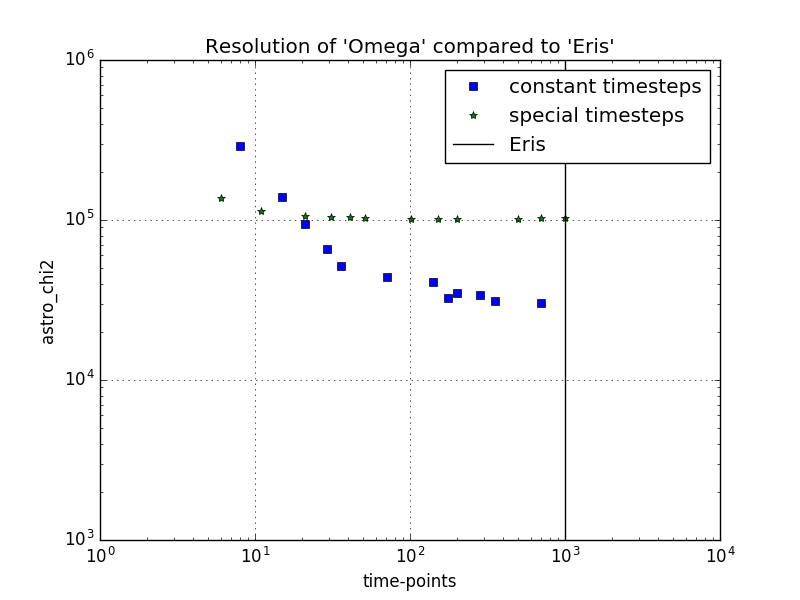
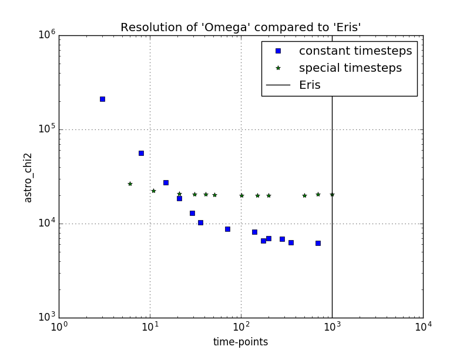
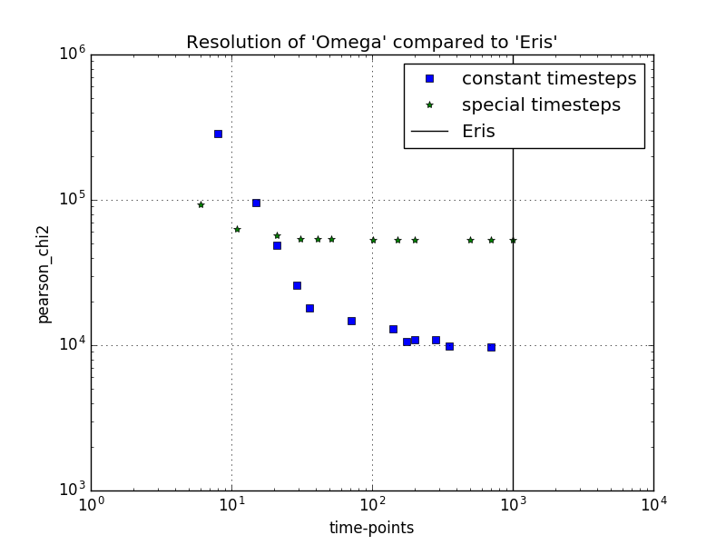
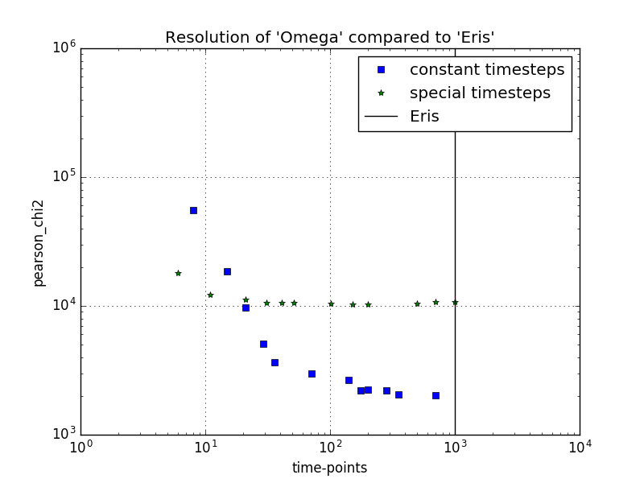
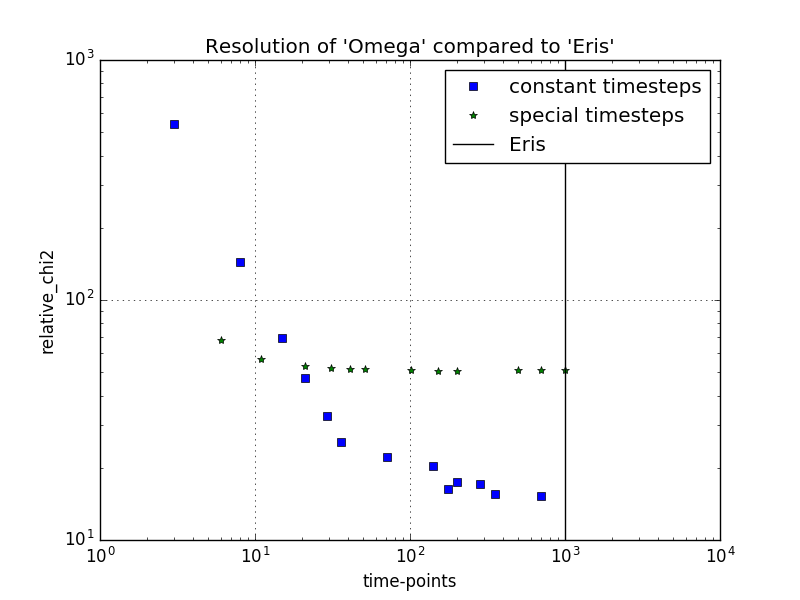
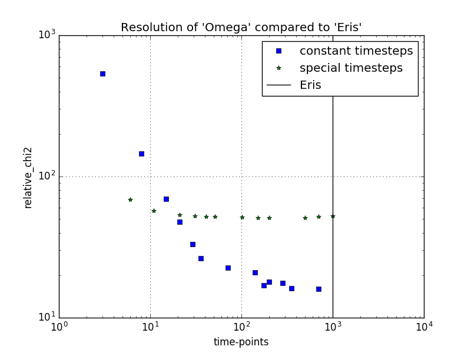

Results from _resolution analysis_ of 'Omega'
=======================================================

This folder probes 'Omega' at constant timestep for different steplengths.

Contents:
----------
- Python script that tests and tabulates various values of time-step length, as well as testing some constant timestep values.
- Data as plots and tables

Method:
--------
The Pearson X^2 statistic is calculated from **[Eu/H]** from 'Omega' as _observables_, while the **[Eu/H]** from 'Eris' are taken as _expected_. Two more statistical parameters are used, called Astrophysical X^2, and Relative X^2. They are analogous to the Pearson X^2 parameter, but the denominator is different.
The X^2 is then calculated versus steplength/timesteps.

The statistical parameters are defined as follows:
 - Pearson X^2 = Sum( (O-E)^2/(|E|) )
 ``` LaTeX
 Pearson $\chi^2$ = \Sum_{i=0}^N \frac{(O-E)^2}{|E_i|}
 ```
 - Astrophysical X^2 = Sum( (O-E)^2 )
 ``` LaTeX
 Astrophysical $\chi^2$ = \Sum_{i=0}^N (O-E)^2
 ```
  - Relative X^2 = Sum( (O-E)^2/N )
 ``` LaTeX
 Pearson $\chi^2$ = \Sum_{i=0}^N \frac{(O-E)^2}{N}
 ```
 
Results:
---------
The statistical parameters are plotted below(unable to reference in GFM). The results are quite clear. Both types of timestepping converges for >100 timepoints, also constant steplength seem to be more accurate, even though logarithmic timesteps are probably more accurate compared to simulation-SFR(more intense in the beginning).
All data can be found as tables, with step-length and calculation time.

These images.
[rel_chi2](timestep_resolution_relative_chi2.png)
[pearson_chi2](timestep_resolution_pearson_chi2.png)
[astro_chi2](timestep_resolution_astro_chi2.png)

Results part II:
------------------
In this section the different chi^2 values are compared in more detail. One set of three chi^2 values are plotted against timestep with the interpolation steps linear and two times as many as the most detailed interpolation-data. Then, the same is done, but with a interpolation-timeaxis that matches that of 'Eris'.

Original (2*n\_max ~ 2000)| Follow 'Eris' (~1000)
:------------------------:|:--------------------:
 |
:----------------------------------------:|:----------------------------------------:
|
:-:|:-:
|
