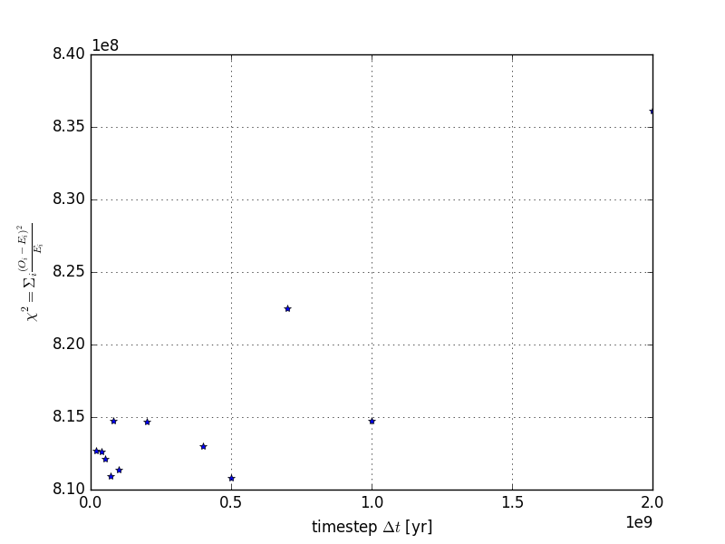

Results from _resolution analysis_ of 'Omega'
=======================================================

This folder probes 'Omega' at constant timestep for different steplengths.

Contents:
----------
- Python script that tests and tabulates various values of time-step length
- Data as plot and table

Method:
--------
The Pearson $\chi^2$ statistic is calculated from **[Eu/H]** from 'Omega' as _observables_, while the **[Eu/H]** from 'Eris' are taken as _expected_.
The $\chi^2$ is then calculated versus steplength/timesteps.

Results:
---------
A table featuring steplength, timesteps, $\chi^2$-value, and computation time can be found in [table](table.dat).
Plotting the data shows, although hard to see, the $\chi^2$ statistic decreases as steplength decreases. The $\chi^2$ statistic also flattens for values between [0,5]e+8 yr.

